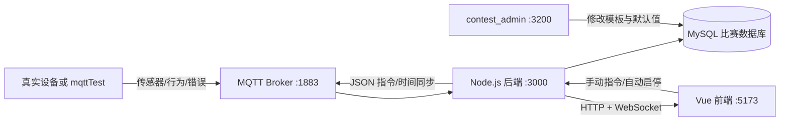
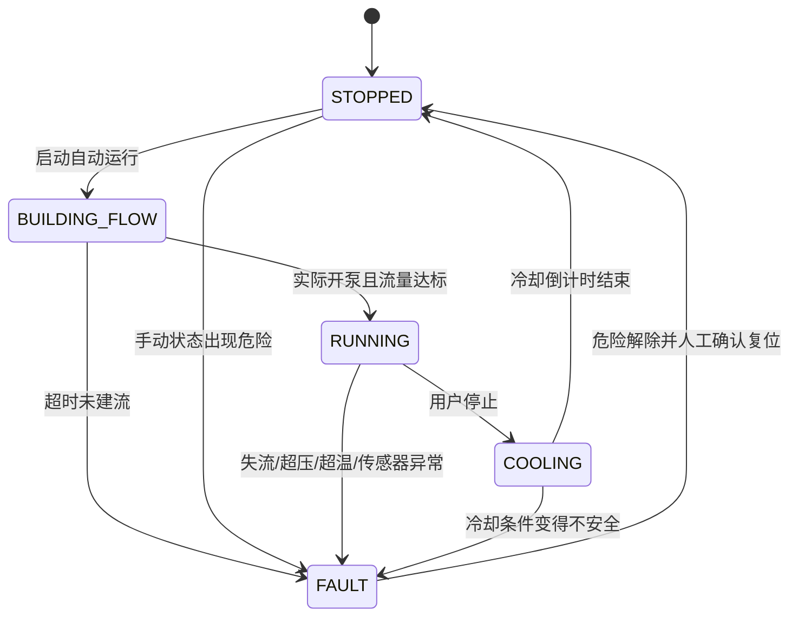

# 26InterThing 功能完成情况与测试说明书（零基础版）

> 文档核对日期：2026-08-24
> 适用目录：`H:\Project\26InterThing`
> 用途：了解当前完成内容、从零启动项目，并按步骤验收比赛功能

> 2026-09-05 重要变更：心跳机制已经停用。无需发送 `device/heartbeat`，系统不再判断设备在线/离线，也不会缓存或恢复补发离线指令。本文后续涉及心跳、离线判定、上线补发和自动心跳的旧测试步骤均不再适用。

## 1. 项目是什么

`26InterThing` 是 2026 湖南省物联网应用创新竞赛技能赛的应用层准备项目。

它完成了从设备数据进入 MQTT，到 Node.js 后端处理、MySQL 保存、WebSocket 实时推送、Vue 页面展示，再到页面/自动控制逻辑向设备发布指令的完整应用层链路。



简单理解：

- `mqttTest`：假装是一台真实设备。
- MQTT Broker：设备和应用层之间的消息中转站。
- `backend`：项目的大脑，负责数据、接口、指令和水循环安全逻辑。
- `frontend`：比赛展示和操作页面。
- `contest_admin`：修改数据库模板和自定义设备 JSON 指令的配置后台。

## 2. 当前完成情况总览

| 模块 | 当前状态 | 已完成内容 |
|---|---|---|
| 设备心跳 | 已停用 | 不订阅心跳、不判断在线/离线，页面显示“未启用心跳” |
| 传感器数据 | 已完成 | MQTT 接收、字段映射、MySQL 入库、实时卡片、实时趋势、历史分页与图表 |
| 行为数据 | 已完成 | MQTT 接收、映射入库、实时/历史页面、PID 语义支持 |
| 错误/告警 | 已完成 | 错误上报、错误码映射、历史查询、WebSocket 实时告警、提示音 |
| 设备管理 | 后端和页面已完成 | 查询、新增、编辑、删除；当前默认单设备界面不在菜单显示，推荐通过 `contest_admin` 管理 |
| 指令配置 | 已完成 | 树形控件、全局值、单设备值、6 类控件、设备自定义 MQTT 主题和 JSON 模板 |
| 指令下发 | 已完成 | QoS 1、双发、Broker 发布结果、超时、失败历史；无心跳拦截和离线缓存 |
| 指令上报 | 已完成 | 设备端 `device/direct` 上报更新设备值并记录历史 |
| 操作历史 | 已完成 | 应用层下发/设备端上报、原值/新值、发布成功/失败、时间筛选和分页 |
| 时间同步 | 已完成 | 页面主动校时、设备通过 `device/timeRequest` 请求校时 |
| 水循环自动控制 | 已完成 | 五态状态机、建流、回差控温、正常冷却停机、复位和多项安全保护 |
| 传感器有效性 | 已完成 | 四项传感器分别保存值与服务端接收时间，缺失/非法不再按 0 处理 |
| MQTT 发布状态 | 已完成 | 期望状态与实际状态分离、失败/超时可见、自身消息回环过滤 |
| 仿真控制台 | 已完成 | Broker 重连、设备号切换、物理参数、连续上报、场景宏、指令监听 |
| 智能判定 | 预留接入 | 可把勾选的历史数据转发给题目提供的 HTTP 服务；未配置时返回待接入提示 |
| 设备执行 ACK | 明确不实现 | 当前只确认 MQTT 发布/PUBACK，不确认真实继电器执行结果 |

## 3. 当前明确边界

在测试前先了解这些边界，避免把正常现象当成故障：

1. “发布成功”只表示 MQTT Broker 接收了应用层消息，不表示设备或继电器已经执行。
2. `pumpState/heaterState` 只根据设备上报的 `water_Y2/heat_Y1` 更新；页面下发后只会先更新期望状态。
3. 后端会将同一指令可靠双发，设备必须按幂等方式处理；`mqttTest` 的接收列表通常会看到两条相同消息。
4. 指令值目前是先写数据库，再尝试 MQTT 发布。发布失败时历史会显示失败、期望状态会回滚，但数据库中的控制值可能已经更新；判断设备是否动作必须看“实际状态”。
5. 项目不会创建完整比赛数据库，只会补少量运行依赖表、列和控制配置。
6. 智能判定目前只负责可配置 HTTP 转发和返回结果，不自动把识别结果写回行为表。
7. 当前前端默认按单设备模式显示，设备管理菜单和单设备覆盖树默认隐藏；设备维护可直接使用 `contest_admin`。
8. `mqttTest` 默认只监听应用下发的 `device/direct` 和 `device/updateTime`。自定义为其他 MQTT 主题后，仿真器不会显示该消息。

## 4. 目录和端口

| 目录/服务 | 用途 | 默认地址 |
|---|---|---|
| `backend` | HTTP、WebSocket、MySQL、MQTT、水循环引擎 | `http://localhost:3000` |
| `frontend` | 比赛应用层页面 | `http://localhost:5173` |
| `mqttTest` | 设备和水循环物理环境仿真 | `http://localhost:4000` |
| MySQL | 业务数据和配置 | `localhost:3306` |
| MQTT Broker | 消息中转 | `localhost:1883` |
| `contest_admin` | 独立数据库配置后台 | `http://localhost:3200` |

这几个端口互不冲突，可以同时启动。

## 5. 使用前准备

### 5.1 软件

建议准备：

- Windows 10/11。
- Node.js 22；当前验证版本 `v22.16.0`。
- pnpm 10；当前验证版本 `10.15.0`。
- MySQL 8.x。
- MQTT Broker，例如现场已有 EMQX 或 Mosquitto。

前端声明的 Node.js最低要求是：

```text
^20.19.0 或 >=22.12.0
```

检查命令：

```powershell
node -v
pnpm -v
```

### 5.2 数据库基础表

完整运行至少需要已有的比赛业务表：

- `t_device`
- `t_sensor_field_mapper`
- `t_sensor_data`
- `t_behavior_field_mapper`
- `t_behavior_data`
- `t_error_msg`
- `t_direct_config`
- `t_direct_global`
- `t_direct`

可选表：

- `t_device_media`：实时页面显示设备图片/媒体；不存在时后端会自动忽略。

后端启动时会自动做这些增量初始化：

- 创建并补默认值：`t_error_code_mapper`。
- 创建：`t_direct_history`。
- 给 `t_direct_config` 补 `publish_topic`、`payload_template`、`value_map` 三列。
- 幂等补齐水循环 10 项参数、控制模式、水泵和加热节点。
- 只补缺失配置和默认值，不覆盖已存在的现场 MQTT 模板。

如果基础业务表完全不存在，启动日志会报 SQL 错误；需要先导入比赛数据库，不能只靠启动后端完成建库。

### 5.3 MQTT Broker

项目内没有 Broker 服务。必须先确认现场 Broker 已启动，并掌握：

- Host/IP
- 端口，通常 `1883`
- 用户名
- 密码
- 每个客户端唯一的 `clientId`

后端、`mqttTest` 和真实设备必须连接同一个 Broker。

## 6. 第一次配置

### 6.1 配置后端 `.env`

打开 PowerShell：

```powershell
cd H:\Project\26InterThing\backend
Test-Path .env
```

如果返回 `False`，复制示例：

```powershell
Copy-Item .env.example .env
notepad .env
```

如果返回 `True`，不要覆盖，直接编辑：

```powershell
notepad .env
```

按现场实际值修改：

```dotenv
DB_HOST=localhost
DB_PORT=3306
DB_USER=root
DB_PASSWORD=你的数据库密码
DB_NAME=Q3

MQTT_HOST=localhost
MQTT_PORT=1883
MQTT_CLIENT_ID=portfolio_admin_唯一后缀
MQTT_USERNAME=你的MQTT用户名
MQTT_PASSWORD=你的MQTT密码

PORT=3000
FRONTEND_ORIGINS=http://localhost:5173
```

注意：

- 不要把真实 `.env` 发给别人或提交到 Git。
- `MQTT_CLIENT_ID` 必须唯一；相同 ID 同时上线会互相踢下线。
- 数据库就在本机时用 `localhost`；设备或另一台电脑连接 Broker 时不能把它们自己的 `localhost` 当成你的电脑。
- `DB_NAME` 必须与 `contest_admin` 当前连接的数据库一致，才能看到同一套配置。

智能判定为可选项。题目提供 HTTP 服务时再配置：

```dotenv
AI_RECOGNIZE_URL=http://127.0.0.1:8000/predict
AI_RECOGNIZE_PAYLOAD_TEMPLATE=config/ai-recognize-payload.json
AI_RECOGNIZE_PAYLOAD_KEY=rows
```

没有智能服务时可以删除/留空 `AI_RECOGNIZE_URL`，历史页“识别”按钮会返回待接入提示。

### 6.2 配置前端 `.env`

```powershell
cd H:\Project\26InterThing\frontend
Test-Path .env
```

如果没有：

```powershell
Copy-Item .env.example .env
notepad .env
```

本机使用：

```dotenv
VITE_API_BASE_URL=http://localhost:3000
```

局域网另一台电脑访问时，浏览器中的 `localhost` 指向那台电脑自己，所以要改成运行后端电脑的局域网 IP，例如：

```dotenv
VITE_API_BASE_URL=http://192.168.1.20:3000
```

同时在后端 `.env` 增加对应前端来源：

```dotenv
FRONTEND_ORIGINS=http://localhost:5173,http://192.168.1.20:5173
```

改 `.env` 后必须重启对应服务。

### 6.3 配置 mqttTest `.env`

`mqttTest` 没有示例文件。如果目录中已经有 `.env`，只检查，不要覆盖。没有时可用记事本新建：

```powershell
cd H:\Project\26InterThing\mqttTest
notepad .env
```

示例内容：

```dotenv
PORT=4000
MQTT_HOST=localhost
MQTT_PORT=1883
MQTT_CLIENT_ID=device_sim_202111
MQTT_USERNAME=你的MQTT用户名
MQTT_PASSWORD=你的MQTT密码
```

保存时确认文件名确实是 `.env`，不是 `.env.txt`。

## 7. 安装依赖

三个目录分别安装一次。

### 7.1 后端

```powershell
cd H:\Project\26InterThing\backend
pnpm install
```

### 7.2 前端

```powershell
cd H:\Project\26InterThing\frontend
pnpm install
```

### 7.3 仿真器

```powershell
cd H:\Project\26InterThing\mqttTest
pnpm install
```

以后依赖没有变化时，不用每次重复安装。

## 8. 正确启动顺序

### 第 1 步：启动 MySQL

用 MySQL 服务管理器、Workbench 或现场方式确认数据库可连接。

### 第 2 步：启动 MQTT Broker

确认 `1883` 正在监听，并且用户名密码有效。

### 第 3 步：启动 26InterThing 后端

打开 PowerShell 窗口 A：

```powershell
cd H:\Project\26InterThing\backend
pnpm dev
```

重点观察日志：

```text
数据库连接成功！
MQTT连接成功
Node 接口服务已启动，地址：http://localhost:3000
错误码映射表已就绪
指令操作历史表已就绪
水循环控制配置已就绪
```

如果只看到 HTTP 启动，而数据库或 MQTT 报错，页面可能能打开，但数据和指令功能不能正常工作。

### 第 4 步：启动前端

打开 PowerShell 窗口 B：

```powershell
cd H:\Project\26InterThing\frontend
pnpm dev
```

浏览器打开：

```text
http://localhost:5173
```

### 第 5 步：启动设备仿真器

打开 PowerShell 窗口 C：

```powershell
cd H:\Project\26InterThing\mqttTest
pnpm start
```

浏览器打开：

```text
http://localhost:4000
```

注意：`mqttTest` 的 `pnpm test` 只是一个未实现的占位脚本，会故意返回失败；启动仿真器用 `pnpm start`，不要用 `pnpm test`。

### 第 6 步：需要改配置时再启动 contest_admin

它的详细步骤见：[contest_admin 项目使用说明书](../contest_admin/项目使用说明书.md)。

## 9. 第一次跑通一个可见结果

先不要测试故障，按下面步骤跑通正常数据：

1. 在 `contest_admin` 的“设备与 PID”中确认至少有一台设备。
2. 记住它的设备编号，例如 `202111`。
3. 打开 `mqttTest`，把“模拟设备号”改成完全相同的编号。
4. 确认 `mqttTest` 顶部显示 MQTT 已连接。
5. 点击“一键恢复物理常态”。
6. 点击“启动自动心跳”。
7. 选择 `1000ms`，点击“开启连续自动上报”。
8. 打开 `26InterThing` 前端。
9. 顶部应出现该设备，状态由离线变为在线。
10. 进入“传感器数据 → 实时数据”，应看到最新数据和趋势图。
11. 进入“指令信息”，应看到当前设备的水循环状态。

如果顶部在线但传感器页面没有四项水循环数据，检查 `t_sensor_field_mapper`。推荐映射：

| 页面显示 | MQTT `p_name` | 数据库 `db_name` | 单位 |
|---|---|---|---|
| 出口水温 | `temp_out` | `field2` | `℃` |
| 入口水温 | `temp_in` | `field3` | `℃` |
| 管路压力 | `pressure` | `field4` | `kPa` |
| 流量 | `flow_rate` | `field5` | `L/min` |

水循环安全引擎直接读取 MQTT 原始字段，所以字段没有显示出来时，控制保护仍可能工作；但比赛展示和历史入库需要正确映射。

## 10. 页面功能说明

### 10.1 顶部设备状态栏

显示：

- 设备编号。
- 在线正常、在线异常或离线状态点。
- 水循环状态：已停止、建流中、自动运行中、冷却中或故障。
- 故障时显示具体原因。
- 告警声音开关。

设备超过 6 秒没有心跳后会被判离线，后台每 3 秒检查一次，因此页面变化可能比 6 秒稍晚。

### 10.2 传感器实时数据

显示：

- 数据库中最新一条传感器记录。
- 字段映射后的中文名称和单位。
- 当前分钟趋势图。
- 状态码 `VStatus` 的正常/告警语义。
- 可选设备媒体。

未指定设备时，后端取全局最新记录，不再写死设备号 `202111`。

### 10.3 传感器历史数据

支持：

- 开始时间和结束时间筛选。
- 分页。
- 映射驱动的动态列。
- 折线图、柱状图、散点图。
- 勾选多行后点击“识别”。

没有配置 `AI_RECOGNIZE_URL` 时，“识别”只返回“已选择多少条、接口待接入”；这是当前设计，不是页面故障。

### 10.4 行为实时/历史数据

读取 `t_behavior_field_mapper` 和 `t_behavior_data`，用法与传感器页面相同。可展示：

- 行为文字。
- 刷卡/PID。
- 识别或设备运行事件。
- 历史趋势和分页。

### 10.5 错误信息

支持：

- 按时间查询 `t_error_msg`。
- 显示设备编号、错误编号、类型和说明。
- 错误类型分布图。
- 接收 WebSocket 实时错误。
- 弹出告警通知并播放短提示音。

水循环故障也会写入 `t_error_msg`，错误编号使用结构化故障码。

### 10.6 设备管理

后端和 `/device` 页面支持设备增删改查。当前默认单设备模式下菜单项被隐藏，建议直接在 `contest_admin` 管理设备。手工访问 `http://localhost:5173/device` 仍可进入页面，但比赛前应以当前实际导航为准。

### 10.7 指令信息

页面顶部操作：

- “启动自动运行”
- “停止”
- “故障复位”
- “更新时间”

状态区显示：

- 状态机状态。
- 水泵实际/期望状态。
- 加热器实际/期望状态。
- 建流或冷却倒计时。
- 具体离线传感器。
- 最近一次发布失败。
- 故障原因。

下方全局指令树由数据库 `t_direct_config` 和 `t_direct_global` 动态生成。支持：

- 开关。
- 输入框。
- 滑块。
- 时间。
- 单选。
- 复选。

水循环 10 项数值参数会进行：

- 必须是数字。
- 必须大于 0。
- 使用数据库已有 `min/max` 校验。
- 最高安全温度必须大于目标温度。
- 温度回差必须小于目标温度。

### 10.8 操作历史

记录：

- 操作时间。
- 指令名称和类型。
- 设备编号。
- 原值和新值。
- 方向：应用层下发或设备端上报。
- 发布结果：成功或失败。
- 详细原因。

其中 `success/failed` 只表示 MQTT 发布结果，不表示设备已经执行。

## 11. MQTT 主题和消息格式

### 11.1 设备端发给应用层

| Topic | 用途 |
|---|---|
| `device/heartbeat` | 心跳和 `VStatus` |
| `device/sensor` | 传感器及执行器实际状态 |
| `device/behavior` | 行为/PID 数据 |
| `device/error` | 错误/告警 |
| `device/timeRequest` | 请求应用层校时 |
| `device/direct` | 设备本地操作后的指令值上报 |

设备编号统一放在 payload 的 `d_no`，不放在 topic 路径中。

水循环传感器标准示例：

```json
{
  "d_no": "202111",
  "c_time": "2026-08-24 09:00:00",
  "temp_out": 28.5,
  "temp_in": 25.0,
  "flow_rate": 0.8,
  "pressure": 85.0,
  "heat_Y1": 0,
  "water_Y2": 1,
  "VStatus": 0,
  "online": "实时数据"
}
```

四项安全传感器：

- `temp_in`：入口温度。
- `temp_out`：出口温度。
- `flow_rate`：流量。
- `pressure`：压力。

实际执行器状态：

- `heat_Y1=1/0`：加热器实际开/关。
- `water_Y2=1/0`：水泵实际开/关。

行为示例：

```json
{
  "d_no": "202111",
  "text_field": "水泵运行正常",
  "pid": "CARD_8899A",
  "c_time": "2026-08-24 09:00:00",
  "online": "实时数据"
}
```

错误示例：

```json
{
  "d_no": "202111",
  "e_no": "E201",
  "type": "6",
  "e_msg": "管路压力过高",
  "c_time": "2026-08-24 09:00:06"
}
```

非法 JSON 会被记录原始 payload 并忽略，不再让后端因为 `JSON.parse` 直接崩溃。缺少 `d_no` 的设备消息也会被忽略。

### 11.2 应用层发给设备端

默认主题：

- `device/direct`：业务控制指令。
- `device/updateTime`：时间同步。

未配置自定义模板时，兼容旧指令：

```json
{
  "d_no": "202111",
  "config_id": 21,
  "topic": "pump",
  "value": "on"
}
```

配置自定义 JSON 后，可以按设备要求发布：

```json
{
  "mb": "010600010001",
  "sn": 1,
  "ack": 0,
  "crc": 1,
  "uart": 6
}
```

详细配置方法见：[contest_admin 项目使用说明书的“控制模板和自定义 JSON 指令”](../contest_admin/项目使用说明书.md#10-控制模板和自定义-json-指令)。

## 12. 水循环自动控制完成内容

### 12.1 五态状态机



| 状态 | 中文 | 含义 |
|---|---|---|
| `STOPPED` | 已停止 | 自动流程未运行 |
| `BUILDING_FLOW` | 正在建流 | 已发布关加热和开泵，等待实际流量建立 |
| `RUNNING` | 自动运行中 | 按出口温度做回差控温 |
| `COOLING` | 冷却延时中 | 加热已关闭，水泵继续散热 |
| `FAULT` | 故障停机 | 被安全保护锁定，必须人工复位 |

### 12.2 默认控制参数

| 业务标识 | 默认值 | 单位 | 含义 |
|---|---:|---|---|
| `target_temperature` | 35.0 | ℃ | 目标出口温度 |
| `temperature_hysteresis` | 0.5 | ℃ | 回差 |
| `min_safe_flow` | 0.5 | L/min | 最低安全流量 |
| `max_safe_pressure` | 150 | kPa | 最大安全压力 |
| `max_safe_temperature` | 45 | ℃ | 入口/出口最高安全温度 |
| `build_flow_timeout` | 5 | 秒 | 启动建流最长等待 |
| `low_flow_confirm_time` | 2 | 秒 | 运行低流确认时间 |
| `cooling_delay` | 10 | 秒 | 正常停止后的水泵冷却时间 |
| `data_timeout` | 3 | 秒 | 四项传感器数据新鲜度 |
| `command_timeout` | 2 | 秒 | 等待 MQTT 发布/PUBACK 的最长时间 |

`data_timeout` 和 `command_timeout` 都明确按秒解释。

### 12.3 自动启动

启动前必须满足：

- 四项传感器都有合法数值。
- 四项传感器都没有超过 `data_timeout`。
- 入口和出口温度都低于最高安全温度。
- 压力低于最高安全压力。
- 当前不在未复位的 `FAULT`。

启动顺序：

1. 发布关闭加热。
2. 第一步成功后发布开启水泵。
3. 第二步成功后进入 `BUILDING_FLOW`。
4. 等待设备上报 `water_Y2=1`、流量不低于最低值、压力安全。
5. 满足后进入 `RUNNING`。

任何一步发布失败都会进入故障，不继续后续动作。

### 12.4 回差控温

默认目标 `35.0℃`，回差 `0.5℃`：

- `temp_out <= 34.5℃`：开启加热。
- `temp_out >= 35.0℃`：关闭加热。
- `34.5℃ < temp_out < 35.0℃`：保持之前状态，避免频繁抖动。

边界值采用包含比较，`34.5℃` 会开，`35.0℃` 会关。

### 12.5 建流超时

自动启动后超过 `build_flow_timeout` 仍未达到最低流量：

- 关加热。
- 停水泵。
- 进入 `FAULT`。
- 写入错误和指令历史。
- 等待人工复位。

### 12.6 运行失流

`RUNNING` 且水泵实际开启时，流量低于 `min_safe_flow` 持续达到确认时间：

- 无论加热器当时是否开启，都关加热并停泵。
- 进入 `FAULT`。
- 不自动重启。

默认流量恰好 `0.5L/min` 仍允许运行；小于 `0.5` 才开始低流计时。

### 12.7 超温

入口或出口任一温度达到 `45℃`：

- 立即关闭加热。
- 如果水泵实际开启、流量和压力安全，保留水泵散热。
- 如果散热条件不安全，停泵。
- 进入故障锁定。

只有“单独超温且流量、压力正常”才允许留泵散热。

### 12.8 超压

水泵实际开启且压力达到 `150kPa`：

- 立即关加热。
- 立即停泵。
- 进入故障。

水泵实际关闭时，高压力读数不会触发这条超压急停；这避免停机状态的残余/无效压力误报警。

### 12.9 传感器超时和非法值

四项传感器分别保存：

- 最近合法值。
- 服务端接收时间。

缺失字段不会变成 `0`；非法值会把该传感器标记为无效。

保护规则：

- 流量或压力超时/无效：关加热、停泵、进入故障。
- 只有温度超时/无效：先关加热；水泵、流量和压力仍安全时进入短时冷却，否则停泵故障。
- 冷却过程中仍检查流量、压力和新鲜度；不安全时立即停泵。

系统停止且泵/加热都未运行时，传感器过期会在状态中显示，但不会无意义地反复触发停机；再次启动时会被拒绝。

### 12.10 正常停止

顺序：

1. 发布关闭加热。
2. 如果水泵正在运行，进入 `COOLING`。
3. 默认延时 10 秒。
4. 发布关闭水泵。
5. 回到 `STOPPED`。

如果关闭加热发布失败：

- 进入故障。
- 保留水泵运行，以免在加热可能仍开启时直接停泵。

### 12.11 手动加热安全拦截

手动开启加热前检查：

- 四项传感器均合法且新鲜。
- 不在故障状态。
- 水泵实际开启。
- 流量达到安全值。
- 压力安全。
- 温度安全。

任何一项不满足都会拒绝发布，前端开关刷新后回滚。

### 12.12 故障复位

复位必须：

- 用户在页面二次确认。
- 四项数据已经恢复新鲜、合法。
- 温度已低于安全上限。
- 压力已低于安全上限。

复位动作会发布：

1. 关加热。
2. 关水泵。
3. 清除故障。
4. 回到 `STOPPED`。

危险条件未解除时复位会失败；故障未复位时直接点击启动也会失败。

### 12.13 复合故障优先级

同一条传感器消息会先收集安全条件，再统一做一次决策：

- 超温和超压同时发生：以超压停泵策略优先。
- 超温时流量也不安全：不会保留水泵散热。
- 只在单独超温、流量与压力安全时留泵。

这样不会因为故障文案顺序而重复执行互相矛盾的动作。

## 13. 自定义设备 JSON 指令如何接入

在 `contest_admin` 的“控制模板配置”为每个节点设置：

- 业务标识 `topic`。
- 真实 MQTT 主题 `publish_topic`。
- 完整 JSON 对象 `payload_template`。
- 可选值映射 `value_map`。

可用变量：

- `{{d_no}}`
- `{{config_id}}`
- `{{topic}}`
- `{{value}}`
- `{{mapped_value}}`

水泵示例：

```json
{
  "mb": "{{mapped_value}}",
  "sn": 1,
  "ack": 0,
  "crc": 1,
  "uart": 6
}
```

```json
{
  "on": "010600010001",
  "off": "010600010000"
}
```

加热器值映射：

```json
{
  "on": "010600020001",
  "off": "010600020000"
}
```

`mqttTest` 能识别上面四个 Modbus 报文码，并自动修改仿真的 `water_Y2/heat_Y1`，方便观察“期望状态”如何变成“实际状态”。

## 14. 自动化测试和构建

下面结果已于 2026-08-24 在当前代码上实际执行。

### 14.1 后端测试

```powershell
cd H:\Project\26InterThing\backend
pnpm test
```

实际结果：

```text
tests 84
pass 84
fail 0
```

覆盖内容包括：

- 自定义 JSON 模板和值映射。
- 配置幂等初始化。
- 实时/历史/图表不再写死设备号。
- 操作历史。
- 错误码映射。
- 心跳、上线校时和离线恢复。
- MQTT QoS 1 双发、发布超时、离线补发。
- 非法 JSON 和本机消息回环。
- AI HTTP 转发模板。
- 五态水循环控制和全部关键保护。
- 34.5/35/45℃、150kPa、0.5L/min 及超时边界。

### 14.2 前端测试

```powershell
cd H:\Project\26InterThing\frontend
pnpm test
```

实际结果：

```text
tests 21
pass 21
fail 0
```

覆盖：

- 图表分钟坐标轴。
- 同分钟实时数据合并。
- 旧数据包丢弃。
- 字段映射和零值保留。
- WebSocket 连接/重连生命周期。
- 水循环参数正数和交叉关系校验。

### 14.3 前端生产构建

```powershell
cd H:\Project\26InterThing\frontend
pnpm build
```

实际构建成功。Vite 会提示主包超过 500kB，这是性能优化警告，不是构建失败，不影响当前比赛局域网功能验收。

### 14.4 不要运行的命令

`mqttTest/package.json` 没有自动测试，下面命令会故意退出 1：

```powershell
cd H:\Project\26InterThing\mqttTest
pnpm test
```

仿真器验收使用浏览器场景和本章后面的端到端步骤。

## 15. 端到端测试前置条件

每次测试前先确认：

- [ ] MySQL 已启动。
- [ ] MQTT Broker 已启动。
- [ ] 后端日志显示数据库和 MQTT 均连接成功。
- [ ] 前端可打开。
- [ ] `mqttTest` 顶部显示已连接。
- [ ] 数据库中有测试设备。
- [ ] `mqttTest` 设备号和数据库设备编号完全一致。
- [ ] 自动心跳已开启。
- [ ] 连续传感器上报已开启，建议 `1000ms`。
- [ ] 测试前先点“一键恢复物理常态”。
- [ ] 使用仿真器而不是真实加热/水泵设备做故障测试。

故障场景之间统一恢复：

1. 在 `mqttTest` 点“一键恢复物理常态”。
2. 重新开启自动心跳和连续上报。
3. 等待至少 1～2 条新传感器消息。
4. 在应用层点“故障复位”。
5. 二次确认。
6. 看到状态回到“已停止”后再做下一项。

## 16. 端到端手工测试

### 场景 1：正常数据链路

操作：

1. `mqttTest` 设置正确设备号。
2. 点“一键恢复物理常态”。
3. 开启自动心跳。
4. 开启 `1000ms` 连续传感器上报。
5. 打开传感器实时页和历史页。

预期：

- 顶部设备在线。
- 实时页每秒更新。
- 趋势图出现数据。
- 历史页能查到新记录。
- 浏览器控制台能看到完整接口日志。

### 场景 2：正常自动升温和回差

操作：

1. 保持物理常态：出口 `28.5℃`、流量 `0.8L/min`、压力 `85kPa`。
2. 确认连续上报和心跳都开启。
3. 在“指令信息”点击“启动自动运行”。

预期顺序：

1. 应用发布关加热。
2. 应用发布开水泵。
3. 页面进入“建流中”。
4. 收到 `water_Y2=1` 和安全流量后进入“自动运行中”。
5. 因 `28.5 <= 34.5`，应用发布开加热。
6. `mqttTest` 将 `heat_Y1` 改为 1，连续上报时温度逐渐上升。
7. 到 `35.0℃` 时应用发布关加热。
8. 操作历史出现 MQTT 发布成功记录。

仿真器会看到相同指令两次，这是后端 QoS 1 可靠双发的设计。

### 场景 3：正常停止和冷却

前置：系统处于自动运行，水泵实际开启。

操作：点击“停止”。

预期：

- 立即发布关加热。
- 页面进入“冷却中”，显示约 10 秒倒计时。
- 倒计时内水泵保持运行。
- 结束后发布关水泵。
- 设备上报 `water_Y2=0` 后，实际状态变为关。
- 页面回到“已停止”。

### 场景 4：启动建流超时

操作：

1. 恢复正常并复位旧故障。
2. 在应用层点击“启动自动运行”。
3. 立即在 `mqttTest` 点击“建流超时 (5s)”；它会保持水泵开、流量为 0 并连续发送约 6 秒。

预期：

- 页面先显示建流倒计时。
- 超过约 5 秒仍无安全流量。
- 发布关加热、关水泵。
- 进入故障。
- 故障码为 `BUILD_FLOW_TIMEOUT`。
- 错误页和操作历史都有记录。

### 场景 5：运行中失流

前置：先完成场景 2，状态必须是 `RUNNING`。

操作：点击 `mqttTest` 的“失流干烧”。

仿真器会把流量设为 `0.1L/min` 并持续上报 4 秒。

预期：

- 低流持续达到默认 2 秒后触发。
- 无论加热实际是否开启，都发布关加热和关水泵。
- 进入故障，故障码 `LOW_FLOW`。
- 不自动重新启动。

### 场景 6：超温

前置：系统运行，泵开、流量和压力安全。

操作：点击“超温告警 (46.5℃)”。

预期：

- 立即发布关加热。
- 故障码 `OVER_TEMPERATURE`。
- 流量 `0.8`、压力 `85` 安全时，水泵保持运行散热。
- 页面故障锁定，不能直接重新启动。

### 场景 7：超压

前置：系统运行且水泵实际开启。

操作：点击“超压急停 (160kPa)”。

预期：

- 立即关加热和水泵。
- 故障码 `OVER_PRESSURE`。
- 页面和错误历史显示管路超压。

### 场景 8：全部传感器中断

前置：系统正在运行。

操作：点击“传感器中断 (6s)”。

预期：

- 自动传感器上报停止。
- 超过默认 `data_timeout=3s` 后显示具体过期传感器。
- 因流量和压力也过期，关加热、停泵并进入故障。
- 场景结束后自动上报仍是关闭状态，需要手动重新开启。

### 场景 9：只让温度传感器超时

这是进阶测试。先停止 `mqttTest` 的连续传感器上报，然后在 PowerShell 连续发送只含流量、压力和执行器状态的数据。把设备号改成你的测试编号：

```powershell
$deviceNo = "202111"
1..5 | ForEach-Object {
  $body = @{
    deviceId = $deviceNo
    custom = $true
    payload = @{
      flow_rate = 0.8
      pressure = 85
      water_Y2 = 1
      heat_Y1 = 0
      VStatus = 0
      online = "实时数据"
    }
  } | ConvertTo-Json -Depth 5
  Invoke-RestMethod -Method Post -Uri "http://localhost:4000/api/sensor/send" -ContentType "application/json" -Body $body
  Start-Sleep -Seconds 1
}
```

预期：

- `temp_in/temp_out` 过期。
- 加热关闭。
- 流量、压力安全且泵在运行时，进入短时冷却。
- 冷却结束后停泵并保持故障，等待人工复位。

测试后点“一键恢复物理常态”，重新开启连续上报，再复位。

### 场景 10：手动加热安全拦截

操作：

1. 将“控制模式”切到手动。
2. 确认水泵实际关闭，或把流量调到小于 `0.5L/min`。
3. 尝试打开加热开关。

预期：

- 页面提示安全拦截原因。
- 不发布开加热。
- 页面刷新后开关回滚。

再测试允许条件：

1. 手动打开水泵。
2. 等待设备上报 `water_Y2=1`。
3. 保持四项数据新鲜、流量不小于 `0.5`、压力和温度安全。
4. 再打开加热。

预期：允许发布开加热。

### 场景 11：停泵时高压力不误报警

前置：手动模式，水泵实际关闭，加热关闭。

在 PowerShell 发送一条压力 160、但 `water_Y2=0` 的完整数据：

```powershell
$body = @{
  deviceId = "202111"
  custom = $true
  payload = @{
    temp_out = 30
    temp_in = 25
    flow_rate = 0
    pressure = 160
    water_Y2 = 0
    heat_Y1 = 0
  }
} | ConvertTo-Json -Depth 5
Invoke-RestMethod -Method Post -Uri "http://localhost:4000/api/sensor/send" -ContentType "application/json" -Body $body
```

预期：不会触发 `OVER_PRESSURE`。如果当前仍处于旧故障，先按统一恢复流程复位后再测。

### 场景 12：超温和超压复合故障

前置：系统运行，水泵实际开启。

```powershell
$body = @{
  deviceId = "202111"
  custom = $true
  payload = @{
    temp_out = 46
    temp_in = 25
    flow_rate = 0.8
    pressure = 160
    water_Y2 = 1
    heat_Y1 = 1
  }
} | ConvertTo-Json -Depth 5
Invoke-RestMethod -Method Post -Uri "http://localhost:4000/api/sensor/send" -ContentType "application/json" -Body $body
```

预期：

- 最终采用超压优先策略。
- 关加热、停水泵。
- 故障码为 `OVER_PRESSURE`。
- 故障原因同时说明检测到温度超限。
- 只产生一套最终保护动作。

### 场景 13：故障复位守卫

操作：

1. 制造超温或超压故障。
2. 危险数值不恢复，直接点击“故障复位”。
3. 再尝试“启动自动运行”。

预期：

- 复位失败，并明确说明温度/压力仍不安全。
- 未复位直接启动失败。

然后：

1. 点“一键恢复物理常态”。
2. 开启连续上报并等 1～2 秒。
3. 点击“故障复位”。
4. 在二次确认框中选择“已检查，确认复位”。

预期：发布关加热、关泵，清除故障并回到 `STOPPED`。

### 场景 14：精确阈值

建议一次只测一个值，故障项之间按统一恢复流程复位。

| 输入值 | 预期 |
|---|---|
| 出口温度 `34.5℃` | 自动运行时开启加热 |
| 出口温度 `35.0℃` | 自动运行时关闭加热 |
| 入口或出口温度 `45.0℃` | 触发超温故障 |
| 压力 `150kPa` 且泵开 | 触发超压故障 |
| 流量 `0.5L/min` | 允许正常运行，不算低流 |
| 流量 `0.49L/min` 持续达到确认时间 | 触发低流保护 |

恰好 2 秒/5 秒的内部定时边界已经由自动化单元测试覆盖。人工观察会受 1 秒看门狗调度影响，允许约 1 秒显示误差。

### 场景 15：Broker 发布失败

只在仿真环境操作：

1. 保持页面和后端运行。
2. 停止 MQTT Broker。
3. 等后端日志显示 MQTT 断开。
4. 在指令页尝试一个开关动作。

预期：

- 页面显示发布失败。
- `lastCommandStatus.status=failed`。
- 期望状态回滚。
- 实际执行器状态不被应用层乐观修改。
- 操作历史 `result=failed`，详情包含 MQTT 未连接。

恢复 Broker 后，等待后端和 `mqttTest` 都显示重新连接，再恢复心跳/传感器。

### 场景 16：MQTT 发布超时

该场景只在仿真数据库测试，不要连接真实执行器：

1. 在 `contest_admin` 临时把 `command_timeout` 改为 `0.01` 秒。
2. 保持 Broker 连接，执行一个安全的关泵/关加热动作。
3. 检查页面和操作历史。
4. 立即把 `command_timeout` 恢复为 `2` 秒。

预期：应用层按发布超时显示失败。由于底层发布动作可能已经开始，Broker/仿真器仍可能收到消息；这也说明“应用层超时”和“设备绝对没有收到”不是同一个结论。

### 场景 17：应用自身消息回环过滤

操作：在应用层下发一次水泵动作。

预期：

- `mqttTest` 因双发看到两条相同下发消息。
- 操作历史只记录一条“应用层下发”业务动作。
- 应用订阅到自己的 `device/direct` 回环时，不会再误记成“设备端上报”。

然后在 `mqttTest` 的“手动单发调试”选择“指令上报”，填写数据库中真实 `config_id` 并发送。

预期：操作历史新增“设备端上报”，证明真正的设备上报仍可识别。

### 场景 18：设备离线和恢复

操作：

1. 点击 `mqttTest` 的“断网离线 (7s)”。
2. 等顶部设备显示离线。
3. 尝试一个非危险控制动作。
4. 点击“恢复上线心跳”。

预期：

- 心跳超时后设备离线。
- 离线时指令不直接算发布成功，会显示未发布/已缓存并记录失败。
- 恢复上线后自动下发时间。
- 缓存指令会尝试补发。
- `mqttTest` 能看到时间同步和补发指令。

### 场景 19：时间同步

两种测试：

1. 在应用层选择时间，点击“更新时间”。
2. 在 `mqttTest` 点击“发送校时请求”。

预期：仿真器“最新时间同步”出现 `device/updateTime` 消息，包含 `nowTime`、`nowdate`，定向校时时还包含 `d_no`。

### 场景 20：行为和错误数据

在 `mqttTest` 的“手动单发调试”中：

1. 发送行为数据。
2. 进入应用层行为实时/历史页检查。
3. 发送错误数据。
4. 进入错误页检查列表、图表和顶部通知。

预期：映射正确时均能入库并实时展示。

### 场景 21：智能判定占位/转发

未配置 AI 服务：

1. 在传感器历史页勾选数据。
2. 点击“识别”。

预期：返回“已选择 N 条传感器数据，智能判定接口待接入”。

配置了 AI 服务：

- 后端按 `backend/config/ai-recognize-payload.json` 组装请求。
- 请求发送到 `AI_RECOGNIZE_URL`。
- 页面显示服务返回结果。
- 当前不会自动把结果写回行为表，需要按现场题目接口再扩展。

## 17. 测试记录表

测试时可以复制下面表格并填写：

| 编号 | 场景 | 预期结果 | 实际结果 | 通过/失败 | 截图/备注 |
|---:|---|---|---|---|---|
| 1 | 正常数据链路 | 在线、实时和历史有数据 |  |  |  |
| 2 | 正常自动升温 | 建流、加热、35℃关闭 |  |  |  |
| 3 | 正常停止 | 关加热、冷却、停泵 |  |  |  |
| 4 | 建流超时 | 双关、故障锁定 |  |  |  |
| 5 | 运行失流 | 双关、LOW_FLOW |  |  |  |
| 6 | 超温 | 关加热、安全时留泵 |  |  |  |
| 7 | 超压 | 双关、OVER_PRESSURE |  |  |  |
| 8 | 传感器中断 | 显示离线项并安全停机 |  |  |  |
| 9 | 温度单独超时 | 关加热、短时冷却 |  |  |  |
| 10 | 手动加热拦截 | 不安全时拒绝 |  |  |  |
| 11 | 停泵高压力 | 不误触发超压 |  |  |  |
| 12 | 复合故障 | 停泵故障优先 |  |  |  |
| 13 | 故障复位守卫 | 危险未解除时拒绝 |  |  |  |
| 14 | 精确阈值 | 边界比较正确 |  |  |  |
| 15 | Broker 失败 | 页面和历史可发现 |  |  |  |
| 16 | 发布超时 | failed 且显示原因 |  |  |  |
| 17 | 自身回环 | 不误记设备上报 |  |  |  |
| 18 | 离线恢复 | 离线、校时、补发 |  |  |  |
| 19 | 时间同步 | 仿真器收到时间 |  |  |  |
| 20 | 行为和错误 | 入库并实时展示 |  |  |  |

## 18. 常见故障排查

### 18.1 前端能打开但全是网络错误

检查：

- 后端 `pnpm dev` 是否仍运行。
- `frontend/.env` 的 `VITE_API_BASE_URL` 是否正确。
- 改 `.env` 后是否重启前端。
- 局域网使用时后端 CORS 是否包含实际前端地址。

按 `F12` 打开 Console。响应拦截器会打印：

- 状态码。
- 方法。
- 完整 URL。
- query/body 参数。
- 脱敏请求头。
- 成功或失败响应。

### 18.2 后端提示数据库连接失败

| 错误 | 常见原因 |
|---|---|
| `ECONNREFUSED` | MySQL 未启动、IP/端口错误 |
| `Access denied` | 用户名/密码或授权错误 |
| `Unknown database` | `DB_NAME` 不存在 |
| `Table ... doesn't exist` | 只建了空库，没有导入业务表 |
| `Unknown column` | 数据库结构版本过旧或映射写错 |

后端数据库试连失败时进程可能仍继续运行，所以不能只看“3000 已启动”；还要看数据库成功日志。

### 18.3 MQTT 一直重连

检查：

- Broker 是否启动。
- Host/端口/用户名/密码是否一致。
- `MQTT_CLIENT_ID` 是否与其他客户端冲突。
- 防火墙是否放行 `1883`。
- 设备在别的电脑时是否错误使用 `localhost`。

### 18.4 顶部没有设备

检查：

- `t_device` 是否有记录。
- 仿真器设备号是否与 `t_device.number` 一致。
- 是否已经启动心跳。
- 后端是否订阅成功 `device/heartbeat`。

### 18.5 设备在线，但自动启动提示传感器超时

心跳只表示在线，不代表四项安全数据存在。检查：

- 连续传感器上报是否开启。
- payload 是否同时包含 `temp_in/temp_out/flow_rate/pressure`。
- 设备号是否一致。
- 上一次数据是否超过 `data_timeout`。
- 数值是否是合法完整数字；`"0.8abc"` 会按非法值处理。

### 18.6 指令发布成功，但实际状态不变

这是“发布成功不等于执行成功”的典型情况。检查：

- 设备是否订阅了正确 `publish_topic`。
- 最终 JSON 是否符合设备协议。
- `mqttTest` 是否识别该格式。
- 设备是否回报 `water_Y2/heat_Y1`。
- 页面“期望状态”和“实际状态”是否不同。

### 18.7 mqttTest 收到两条一样的指令

正常。后端为了可靠性连续发布两次 QoS 1 消息，真实设备应保证重复执行同一命令不会产生副作用。

### 18.8 操作历史显示失败，但页面值变了

当前流程先保存控制值，再发布 MQTT。发布失败不回滚数据库值，但会：

- 将结果记为 `failed`。
- 显示错误原因。
- 回滚应用层期望执行器状态。
- 保留设备实际状态。

验收时以实际状态和设备反馈为准，不以开关保存值单独判断执行成功。

### 18.9 自定义 MQTT 主题后仿真器收不到

`mqttTest` 当前只订阅 `device/direct` 和 `device/updateTime`。用其他主题时：

- 让真实设备订阅该主题；或
- 使用外部 MQTT 客户端观察；或
- 在纯仿真测试节点临时使用 `device/direct`。

### 18.10 故障恢复后仍无法复位

点击“一键恢复物理常态”只发送一次正常数据。还应：

1. 重新开启连续传感器上报。
2. 等待至少 1～2 条新数据。
3. 确认温度、压力安全。
4. 再点故障复位。

## 19. 比赛前最终检查

- [ ] 电脑断网后项目仍能启动。
- [ ] Node.js、pnpm、MySQL、Broker 均已安装。
- [ ] 五个端口无冲突：`1883/3000/4000/5173`，需要后台时再加 `3100/3200`。
- [ ] 后端 `.env` 已备份但没有泄露密码。
- [ ] `contest_admin` 和 `26InterThing` 指向同一数据库。
- [ ] 每台真实设备的 `d_no` 已加入 `t_device`。
- [ ] 每个 MQTT 客户端 ID 唯一。
- [ ] 四项水循环传感器字段名已和设备端对齐。
- [ ] `water_Y2/heat_Y1` 能真实回报。
- [ ] 水泵、加热器 JSON 指令已逐条抓包验证。
- [ ] 设备能够幂等处理双发消息。
- [ ] 10 项水循环参数已经截图或记录。
- [ ] 已跑后端 84 项和前端 21 项测试。
- [ ] 已做正常运行、停止和全部故障宏。
- [ ] 已确认发布失败只代表应用层/Broker结果，不宣称设备 ACK。
- [ ] 已准备数据库备份，比赛当天不随意执行 Q3 模板重置。

## 20. 如何停止全部服务

分别回到后端、前端和 `mqttTest` 的 PowerShell 窗口，按：

```text
Ctrl + C
```

浏览器页面关闭不会结束 Node.js 进程。确认三个窗口都回到命令提示符后，服务才真正停止。

MySQL 和 MQTT Broker 是否停止取决于你采用的安装方式；比赛电脑通常可保持它们运行。

## 21. 相关资料

- [contest_admin 项目使用说明书](../contest_admin/项目使用说明书.md)
- [水循环系统应用层简单控制逻辑需求](水循环系统应用层简单控制逻辑需求.md)
- [水循环系统补充逻辑设计](水循环系统补充逻辑设计.md)
- [API 文档](API文档.md)
- [当前 MQTT 测试数据](MQTT测试数据.md)

注意：旧版 [MQTT 联调说明](MQTT联调说明-设备端连接指南.md) 中包含当时环境的固定 IP 和旧 topic 写法，不能直接照抄。`MQTT测试数据.md` 中也保留了通用传感器的旧字段示例；测试本次水循环时，应使用本说明书中的 `temp_in/temp_out/flow_rate/pressure/heat_Y1/water_Y2`。如文档互相冲突，以当前代码和本说明书为准。
