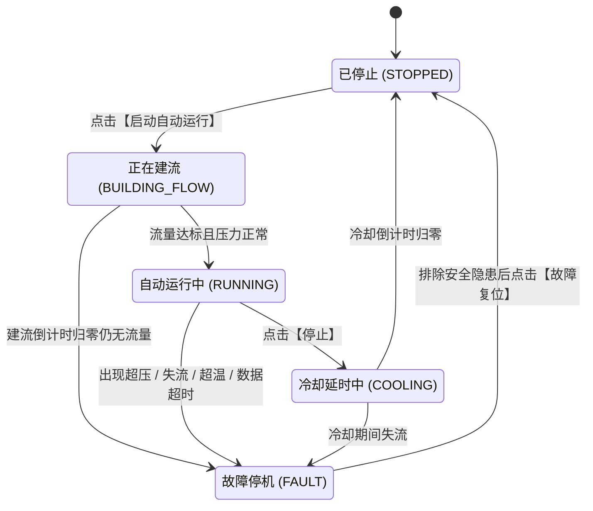

# 水循环系统控制指令、故障类型与状态机技术手册

本文档针对水循环系统界面中的**控制指令参数**、**故障类型与报警现象**、**状态机状态类型**提供精准的技术定义与行为规范。全文使用标准原生 Markdown 排版，支持在大纲视图中快速检索与跳转。

---

## 一、指令参数详解

### 1. 参数快速索引表

| 参数名称 | topic 字段 | 控件类型 | 推荐默认值 | 单位 |
| :--- | :--- | :---: | :---: | :---: |
| 控制模式 | `master` | 开关 | on (开启) | - |
| 目标温度 | `target_temperature` | 输入框 | 30.0 | ℃ |
| 温度回差 | `temperature_hysteresis` | 输入框 | 0.5 | ℃ |
| 允许加热的最低流量 | `min_safe_flow` | 输入框 | 0.5 | L/min |
| 最大安全压力 | `max_safe_pressure` | 输入框 | 100.0 或 150.0 | kPa |
| 最高安全温度 | `max_safe_temperature` | 输入框 | 45.0 | ℃ |
| 水泵启动后等待建立流量的最长时间 | `build_flow_timeout` | 输入框 | 5 | 秒 |
| 水泵运行中低流量故障确认时间 | `low_flow_confirm_time` | 输入框 | 2 | 秒 |
| 关闭加热后水泵继续循环的时间 | `cooling_delay` | 输入框 | 5 或 10 | 秒 |
| 数据更新超时时间 | `data_timeout` | 输入框 | 3 | 秒 |
| MQTT发布超时时间 | `command_timeout` | 输入框 | 2 | 秒 |
| 温度PID最小开启时间 | `pid_min_on_time` | 输入框 | 3 | 秒 |
| 温度PID最小关闭时间 | `pid_min_off_time` | 输入框 | 3 | 秒 |
| 水泵手动开关 | `pump` | 开关 | off | - |
| 加热手动开关 | `heater` | 开关 | off | - |

---

### 2. 各参数技术定义与控制逻辑

#### (1) 控制模式 (`master`)
- **控件形式**：Switch 开关
- **取值范围**：`on`（自动模式） / `off`（手动模式）
- **功能说明**：系统的总控制模式开关。
  - **自动模式 (`on`)**：展开并启用目标温度、回差、安全阈值等全部自动控制参数。此时支持点击顶部的【启动自动运行】按钮，由后端状态机全自动闭环巡航控温。
  - **手动模式 (`off`)**：收起自动参数，仅展示水泵（`pump`）和加热（`heater`）两个点动开关，由人工直接操作下发。

#### (2) 目标温度 (`target_temperature`)
- **控件形式**：数字输入框
- **单位**：℃
- **默认推荐**：30.0 ℃
- **判定逻辑**：自动控温的目标上限值。当出口水温 $T_{out} \ge target\_temperature$ 时，系统自动下发指令关闭加热（`heater -> off`）。

#### (3) 温度回差 (`temperature_hysteresis`)
- **控件形式**：数字输入框
- **单位**：℃
- **默认推荐**：0.5 ℃
- **判定逻辑**：控温缓冲死区区间，用于防止继电器在临界温度频繁振荡开关。
  - **重新开启加热阈值** = $target\_temperature - temperature\_hysteresis$（例如 $30.0 - 0.5 = 29.5℃$）。
  - 当出口水温 $T_{out} \le 29.5℃$ 时，系统自动下发开启加热（`heater -> on`）。
  - 水温在 29.5℃ 与 30.0℃ 之间时，保持当前状态不变。

#### (4) 允许加热的最低流量 (`min_safe_flow`)
- **控件形式**：数字输入框
- **单位**：L/min
- **默认推荐**：0.5 L/min
- **判定逻辑**：防干烧保护的绝对底线。
  - 只有当管道实时流量 $flow\_rate \ge min\_safe\_flow$ 时，才允许开启加热器。
  - 无论在自动还是手动模式下，只要流量低于此数值，加热器严禁开启；运行中若流量跌破此数值，将触发防干烧保护停机。

#### (5) 最大安全压力 (`max_safe_pressure`)
- **控件形式**：数字输入框
- **单位**：kPa
- **默认推荐**：100.0 或 150.0 kPa
- **判定逻辑**：防管路爆裂的压力上限。
  - 水泵运转时，若管路实时压力 $pressure \ge max\_safe\_pressure$，判定管道严重堵塞或憋压，系统立即强制关闭水泵和加热器。

#### (6) 最高安全温度 (`max_safe_temperature`)
- **控件形式**：数字输入框
- **单位**：℃
- **默认推荐**：45.0 ℃
- **判定逻辑**：超温绝对保护红线。
  - 无论入口温度 $T_{in}$ 还是出口温度 $T_{out}$，只要 $\max(T_{in}, T_{out}) \ge max\_safe\_temperature$，系统判定超温故障，强制断开加热器。

#### (7) 水泵启动后等待建立流量的最长时间 (`build_flow_timeout`)
- **控件形式**：数字输入框
- **单位**：秒
- **默认推荐**：5 秒
- **判定逻辑**：建流阶段的等待倒计时。
  - 点击【启动自动运行】后，水泵先开启抽水，系统开始倒计时。
  - 如果在设定秒数内流量未能达到 `min_safe_flow`（0.5 L/min），判定为吸不上水、管道未接通或水泵空转，立即停泵并触发建流超时故障。

#### (8) 水泵运行中低流量故障确认时间 (`low_flow_confirm_time`)
- **控件形式**：数字输入框
- **单位**：秒
- **默认推荐**：2 秒
- **判定逻辑**：低流量防误报滤波时间。
  - 运行过程中若水流偶发跌破 `min_safe_flow`，系统开始计时。
  - 只有当低流量状态**连续持续满该时间**后，才正式判定为失流故障并急停，有效过滤管道小气泡引起的瞬间流量波动。

#### (9) 关闭加热后水泵继续循环的时间 (`cooling_delay`)
- **控件形式**：数字输入框
- **单位**：秒
- **默认推荐**：5 或 10 秒
- **判定逻辑**：停机散热缓冲时间。
  - 点击【停止】或系统停机时，加热器立即切断，但水泵继续运转该设定时间，将电热管表面的高热量冲刷带走，倒计时归零后水泵才真正停止。

#### (10) 数据更新超时时间 (`data_timeout`)
- **控件形式**：数字输入框
- **单位**：秒
- **默认推荐**：3 秒
- **判定逻辑**：传感器失联判定周期。
  - 系统实时追踪每个传感器的接收时间戳。如果距上次收到合法报文的时间超过该秒数，标记该项数据异常。
  - 在自动运行中若检测到传感器数据超时，系统会立即触发安全停机。

#### (11) MQTT发布超时时间 (`command_timeout`)
- **控件形式**：数字输入框
- **单位**：秒
- **默认推荐**：2 秒
- **判定逻辑**：指令发布最长等待时间。
  - 应用层通过 MQTT 发出控制指令时，若在设定秒数内未能完成向 Broker 的投递，判定发布超时并记录错误日志。

#### (12) 温度PID最小开启时间 (`pid_min_on_time`)
- **控件形式**：数字输入框
- **单位**：秒
- **默认推荐**：3 秒
- **判定逻辑**：继电器物理保护。加热器一旦开启，至少持续运行该时间，防止高频开闭损坏物理触点。

#### (13) 温度PID最小关闭时间 (`pid_min_off_time`)
- **控件形式**：数字输入框
- **单位**：秒
- **默认推荐**：3 秒
- **判定逻辑**：继电器物理保护。加热器一旦关闭，至少保持断开该时间，防止快速通断产生破坏性电弧。

#### (14) 水泵与加热手动开关 (`pump` / `heater`)
- **控件形式**：Switch 开关
- **展示条件**：仅在 `master = off`（手动模式）下展示。
- **判定逻辑**：人工直接下发点动指令。手动开启加热前会自动经过安全审查，不符合安全要求时会被直接拦截。

---

## 二、故障类型、触发条件与界面现象详解

### 1. 故障代码与现象总览

| 故障代码 | 中文名称 | 触发条件 | 系统动作 | 界面显示现象 |
| :--- | :--- | :--- | :--- | :--- |
| `BUILD_FLOW_TIMEOUT` | 启动建流超时 | 5秒倒计时结束流量仍未达标 | 停泵、禁加热 | 状态标签变红 `故障停机`；红字提示 `故障：启动未建流` |
| `LOW_FLOW` | 运行中低流量 | 流量连续 2 秒低于 0.5 L/min | 立即关加热、停泵 | 状态标签变红 `故障停机`；红字提示 `故障：运行中流量过低` |
| `OVER_PRESSURE` | 管路超压 | 管路压力达到或超过最大安全压力 | 立即关加热、停泵 | 状态标签变红 `故障停机`；红字提示 `故障：管路超压` |
| `OVER_TEMPERATURE` | 水温超限 | 进水或出水温度达到或超过 45 ℃ | 立即切断加热、留泵散热 | 状态标签变红 `故障停机`；红字提示 `故障：水温超限` |
| `SENSOR_FLOW_TIMEOUT` | 流量数据超时 | 超过 3 秒未收到流量数据 | 立即关加热、停泵 | 状态栏红字 `数据异常：流量`；触发故障停机 |
| `SENSOR_PRESSURE_TIMEOUT` | 压力数据超时 | 超过 3 秒未收到压力数据 | 立即关加热、停泵 | 状态栏红字 `数据异常：压力`；触发故障停机 |
| `SENSOR_TEMPERATURE_TIMEOUT` | 温度数据超时 | 超过 3 秒未收到进水或出水温度 | 立即关加热、延时散热停泵 | 状态栏红字 `数据异常：入口温度、出口温度` |
| `COMMAND_PUBLISH_FAILED` | 指令发布失败 | MQTT发布在 2 秒内超时或断网 | 回滚操作状态 | 状态栏红字 `最后指令失败：XXXX` |

---

### 2. 各故障类型详细剖析

#### (1) 启动建流超时 (`BUILD_FLOW_TIMEOUT`)
- **触发条件**：水泵启动进入【正在建流】阶段，在设定时间（默认 5 秒）倒计时结束时，实时流量依然小于 `min_safe_flow`（0.5 L/min）。
- **保护动作**：立即强制关闭水泵，加热器保持关闭。
- **界面现象**：
  - 顶部状态标签变为红色：`故障停机`；
  - 状态栏出现红色警告文字：`故障：启动未建流(超过5s未达到最低流量)`；
  - 播放声音告警。
- **排查恢复**：检查水箱储水、进水阀门是否打开、水泵是否正常通电接线，确认正常后点击【故障复位】。

#### (2) 运行中低流量失流故障 (`LOW_FLOW`)
- **触发条件**：在自动运行（`RUNNING`）、加热器开启、或冷却状态下，实时流量小于 `min_safe_flow`，且该状态持续时间达到 `low_flow_confirm_time`（默认 2 秒）。
- **保护动作**：立即切断加热器电源，立即关闭水泵，防止电热管干烧损坏。
- **界面现象**：
  - 状态标签跳入红色：`故障停机`；
  - 状态栏红字提示：`故障：运行中流量过低(X.XX L/min < 0.5 L/min)` 或 `故障：冷却期间流量过低`；
  - 播放声音告警。
- **排查恢复**：检查循环水路是否脱落、漏水或水泵意外停转，排除问题后点击【故障复位】。

#### (3) 管路超压故障 (`OVER_PRESSURE`)
- **触发条件**：水泵运行中，实时压力传感器数值 $pressure \ge max\_safe\_pressure$（例如 100 或 150 kPa）。
- **保护动作**：立即强制关闭加热器，立即停止水泵运转，防止高压爆管。
- **界面现象**：
  - 状态标签跳入红色：`故障停机`；
  - 状态栏红字提示：`故障：管路超压(XX kPa >= XX kPa)`；
  - 播放声音告警。
- **排查恢复**：检查出水调节阀门是否关死、过滤器是否堵塞，泄压后点击【故障复位】。

#### (4) 水温超限故障 (`OVER_TEMPERATURE`)
- **触发条件**：实时入口温度 $T_{in}$ 或出口温度 $T_{out} \ge max\_safe\_temperature$（默认 45.0 ℃）。
- **保护动作**：**立即切断加热器**；若当前水流和压力处于安全范围内，水泵保持开启协助循环散热；若水流或压力同时异常，则停泵保护。
- **界面现象**：
  - 状态标签跳入红色：`故障停机`；
  - 状态栏红字提示：`故障：水温超限(XX.X ℃ >= 45.0 ℃)`；
  - 播放声音告警。
- **排查恢复**：等待水流循环将温度降至 45 ℃ 以下后，点击【故障复位】。

#### (5) 传感器数据超时故障 (`SENSOR_*_TIMEOUT`)
- **触发条件**：连续超过 `data_timeout`（默认 3 秒）未收到对应传感器的合法报文，或数值上报为非数字。
- **保护动作**：在非停止状态下，流量或压力数据超时立即关加热并停泵；温度数据超时立即关加热并进入延时散热停泵。
- **界面现象**：
  - 状态栏直接标红提示：`数据异常：入口温度、出口温度、流量、压力`；
  - 系统进入红色 `故障停机`，红字提示具体哪项传感器超时；
  - 播放声音告警。
- **排查恢复**：检查 MQTT 传感器测试发包工具是否在正常推送 `device/sensor` 主题，数据恢复正常后点击【故障复位】。

#### (6) 指令发布失败 (`COMMAND_PUBLISH_FAILED`)
- **触发条件**：向 MQTT Broker 发送控制指令时网络断开，或在 `command_timeout`（默认 2 秒）内未收到响应。
- **保护动作**：回滚界面期望状态，记录失败历史到 `t_direct_history`。
- **界面现象**：
  - 状态栏红字提示：`最后指令失败：XXXX`；
  - 弹出 Element Plus 错误提示气泡。

---

### 3. 手动模式安全前置拦截机制

当控制模式切换为手动（`master = off`）时，系统并非无保护点动。如果用户手动点击开启【加热开关】，系统在下发前会自动执行 6 项严格的安全前置审查。若未满足条件，**指令将被直接拦截，弹出警告对话框，且开关自动回弹至关闭**：

- **拦截条件 1**：关键传感器数据超时或无效，弹窗提示：`数据超时或无效，禁止加热`；
- **拦截条件 2**：设备当前处于故障状态未解除，弹窗提示：`设备仍处于故障状态: 请先复位`；
- **拦截条件 3**：水泵尚未开启（`pumpState != on`），弹窗提示：`水泵未开启，禁止加热`；
- **拦截条件 4**：实时水流不足（$< 0.5\text{ L/min}$），弹窗提示：`当前流量不足，严禁打开加热防止干烧`；
- **拦截条件 5**：管路压力超标（$\ge 150\text{ kPa}$），弹窗提示：`当前管路压力过高`；
- **拦截条件 6**：水温已超标（$\ge 45\text{ ℃}$），弹窗提示：`当前水温过高`。

---

## 三、状态机状态类型详解

水循环控制引擎（`waterControlEngine.js`）维护了一个完整的有限状态机（FSM）。系统在任何时刻必处于以下 **5 种状态** 之一：

---

### 1. 已停止 (`STOPPED`)
- **标签外观**：灰绿色标签 `已停止`
- **执行器状态**：水泵期望 `off`（实际 `off`），加热期望 `off`（实际 `off`）。
- **状态行为**：系统的初始安全待命状态。所有驱动输出全部断开。
- **流转路径**：
  - 点击顶部的【启动自动运行】按钮：系统自动校验当前传感器数据（无故障、无数据超时、水温未超温、压力未超压），校验通过后自动下发开启水泵指令，进入 `BUILDING_FLOW`（正在建流）状态。

---

### 2. 正在建流 (`BUILDING_FLOW`)
- **标签外观**：蓝色信息标签 `正在建流`，右侧展示建流倒计时（如：`剩余 5 秒`）
- **执行器状态**：水泵期望 `on`，**加热期望强制 `off`**。
- **状态行为**：水泵启动后的抽水建流阶段。此时管道内水流尚未充满，系统绝对禁止开启加热，防止发热管干烧。
- **流转路径**：
  - **成功进入自动运行**：当同时满足 `水泵实际已开(water_Y2=1)`、`实时流量 >= min_safe_flow`、`实时压力 < max_safe_pressure` 时，系统自动转移至 `RUNNING`（自动运行中）状态；
  - **建流失败触发故障**：如果建流倒计时归零仍未达到上述流量要求，系统触发 `BUILD_FLOW_TIMEOUT` 故障，关闭水泵并转移至 `FAULT`（故障停机）状态。

---

### 3. 自动运行中 (`RUNNING`)
- **标签外观**：绿色高亮标签 `自动运行中`
- **执行器状态**：水泵期望保持 `on`；加热期望根据水温在 `on` 与 `off` 之间自动切换。
- **状态行为**：系统正常巡航状态，自动执行闭环控温：
  - 当出口水温 $T_{out} \le target\_temperature - temperature\_hysteresis$ 时，自动下发开启加热；
  - 当出口水温 $T_{out} \ge target\_temperature$ 时，自动下发关闭加热。
- **流转路径**：
  - **主动停止**：用户点击【停止】按钮，系统立即下发关闭加热，并转移至 `COOLING`（冷却延时中）状态；
  - **异常停机**：若检测到管路超压、流量过低（持续 2 秒）、水温超标、或传感器数据超时，系统立即中断运行并转移至 `FAULT`（故障停机）状态。

---

### 4. 冷却延时中 (`COOLING`)
- **标签外观**：黄色警告标签 `冷却延时中`，右侧展示冷却倒计时（如：`剩余 10 秒`）
- **执行器状态**：**加热期望强制 `off`**，水泵期望保持 `on`。
- **状态行为**：停机散热缓冲阶段。加热器切断后，发热体仍存在极高表面余热。水泵保持运转强行带走余热，防止管内静止水被余热沸腾汽化损坏管路。
- **流转路径**：
  - **正常停止**：冷却倒计时递减到 0 秒时，系统自动下发关闭水泵指令，平稳转移至 `STOPPED`（已停止）状态；
  - **冷却异常**：如果在冷却倒计时期间检测到水泵完全断流（$flow\_rate \le 0$），散热条件丧失，系统立即下发关闭水泵并转移至 `FAULT`（故障停机）状态。

---

### 5. 故障停机 (`FAULT`)
- **标签外观**：红色高亮标签 `故障停机`，伴随红色故障原因说明
- **执行器状态**：加热期望强制为 `off`；水泵期望通常强制为 `off`（超温保护且流量正常时水泵短时运转辅助降温）。
- **状态行为**：安全锁定保护状态。系统在此状态下拒绝响应【启动自动运行】指令，手动开关同样处于锁定拦截状态。
- **解除与流转路径**：
  - 系统不能自动离开该状态；
  - 必须由操作人员在现场排除物理隐患（补充水源、疏通管路、降温、恢复传感器连接）；
  - 点击界面顶部的橙黄色**【故障复位】**按钮；
  - 系统核验当前安全条件确认无误后，将水泵和加热全部复位为关闭，恢复转移至 `STOPPED`（已停止）待命状态。
