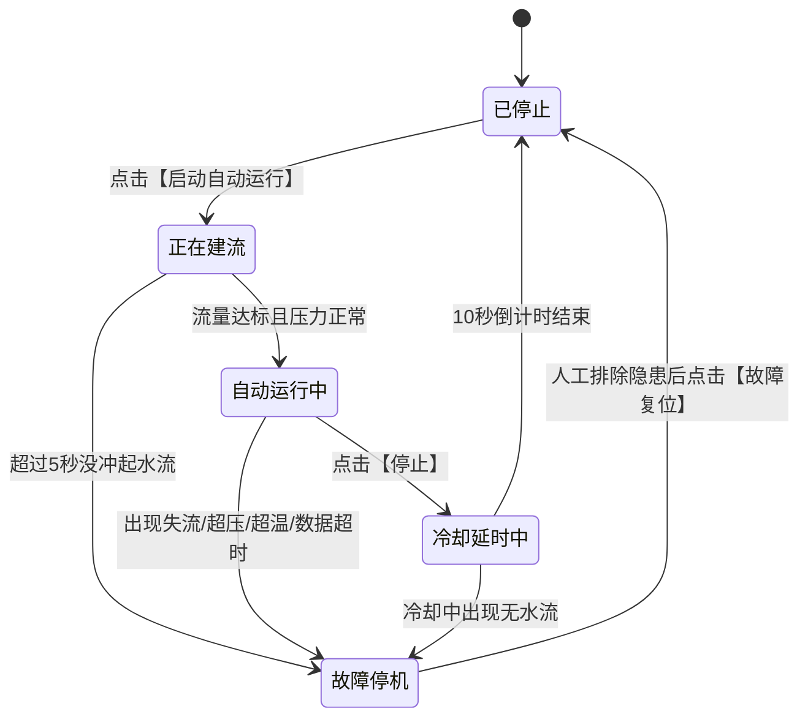

# 水循环系统安全控制与参数配置通俗指南

> 💡 **写在前面**：  
> 如果你第一次看到界面上“回差”、“建流”、“低流量确认”、“冷却延时”、“PID最小开启时间”这些词觉得像看天书，请不要慌！  
> 本文用**最通俗的大白话和生活中的例子**，带你 5 分钟彻底搞懂这套系统到底在干什么、每个参数有什么用、为什么会有各种报警和自动保护。

---

## 一、一句话看懂：水循环系统到底在干嘛？

你可以把整套水循环设备想象成一个**“工业版的高级电热水器 / 燃气热水循环机”**：

```
       ┌──────────┐         ┌──────────┐         ┌──────────┐
───►   │ 循环水泵 │  ────►  │ 加热管道 │  ────►  │ 出口用水 │  ───►
       │ (抽水流动)│         │ (电热棒) │         │ (监测水温)│
       └──────────┘         └──────────┘         └──────────┘
            ▲                    │                    │
            │                    ▼                    │
            └────────── 闭式循环回水管路 ───────────────┘
```

它的工作原理非常简单：
1. **水泵**负责让水在管道里不停流动；
2. **加热器（电热棒）**在水流经过时把水加热到设定温度；
3. **温度传感器、流量计、压力表**实时盯着管道状态，汇报给你的软件界面。

### 为什么需要这么多“安全控制”？
因为水循环系统在工业上属于**高危系统**，极容易引发事故：
- **干烧危险**：加热棒表面温度极高（几百度），必须靠持续流动的水把它散掉。如果**没有水流就通电加热**，几秒钟加热管就会干烧烧红、炸裂或熔断！
- **爆管危险**：如果阀门没开或管道堵塞，水泵拼命抽水，水压飙升，塑料接头和管道会被直接憋爆，水花四溅。
- **余热危险**：即使把加热器断电，加热棒本身的金属依然烫得冒白烟，如果这时候立即把水泵停掉，周围静止的水会被瞬间沸腾汽化！
- **盲人骑瞎马**：如果传感器断线了（网络卡了或设备掉线），软件不知道当前是 20 度还是 100 度，如果盲目加热就是火灾隐患。

因此，界面上所有的按钮和参数，全部是为了**死死防住以上 4 种危险**！

---

## 二、界面的 5 种状态：系统现在到底在干什么？


系统运行就像一个人做事，必须严格按规矩分阶段走。系统在任何时刻一定处于以下 **5 种状态之一**：



### 1. 已停止（STOPPED）
- **现象**：水泵关、加热关，系统安静待命。
- **大白话**：下班了，设备全关，插座拔掉。

### 2. 正在建流（BUILDING_FLOW）
- **现象**：点击【启动自动运行】后，水泵先启动，**加热绝对不开**！界面开始 5 秒倒计时。
- **大白话**：**“先开水泵，等水冲起来再说”**。水泵刚启动时水流还没冲满管道，这时候绝对不能加热；必须确认管道里真的有水流哗哗地流（流量达到要求），才允许进入下一步。

### 3. 自动运行中（RUNNING）
- **现象**：水泵持续运转，根据水温自动开关加热。
- **大白话**：**“自动控温恒温”**。
  - 出口水温低于下限时 $\rightarrow$ 自动打开加热棒；
  - 水温烧到目标温度时 $\rightarrow$ 自动关闭加热棒；
  - 只要水温一掉下来 $\rightarrow$ 再次自动点火加热。

### 4. 冷却延时中（COOLING）
- **现象**：当你点击【停止】时，加热立即切断，但**水泵依然在拼命抽水，并开始 10 秒倒计时**！
- **大白话**：**“吹风扇散余热”**。就像你关掉电吹风，有些吹风机会多吹 5 秒冷风保护热丝；水循环系统关火后，加热棒依然滚烫，水泵必须多转 10 秒把热量冲走，防止局部沸腾烫伤管路。倒计时结束后水泵才会真正停止。

### 5. 故障停机（FAULT）
- **现象**：界面变红、设备锁定、报警提示、可能发出告警声。
- **大白话**：**“保险丝跳闸 / 紧急急停”**。只要触犯了任何一条安全红线，系统立刻剥夺控制权，关加热、关泵，防止事故扩大。此时点任何运行按钮都没用，必须排查问题后点【故障复位】。

---

## 三、界面 12 个参数字典：大白话逐项解读

界面上每一项配置到底控制着什么？请对照下表：

| 界面参数名称 | 当前值 | 它是干什么的（生活大白话） | 如果不设或者设错了会怎样？ |
| :--- | :---: | :--- | :--- |
| **控制模式** | 开关 (开) | **总开关**。开代表“自动巡航恒温”，关代表“手动纯点动开关”。 | 关掉后系统不会自动调节温度，需要你在手动模式下自己按水泵和加热开关。 |
| **目标温度** | `30` ℃ | **你想要的理想水温**。例如你想洗 30℃ 的温水澡。 | 设太高会容易超温报警，设太低水还没烧就停了。 |
| **温度回差** | `0.5` ℃ | **开关加热的缓冲区间**。防止继电器 1 秒开关几百次被烧毁。 | 详见下方“什么是温度回差”，如果设成 0，系统会在 30℃ 临界点疯了一样频繁抖动开关加热。 |
| **允许加热的最低流量** | `0.5` L/min | **开启加热的生命底线**。只有水流大于这个数值，才允许打开加热棒。 | 设得太低，水几乎不流动还通电，直接发生**干烧爆管**！ |
| **最大安全压力** | `150` kPa | **管路耐压红线**。管道里的水压一旦超过这个值，立刻视为爆管隐患。 | 超过这个压力说明阀门没开或管道堵死了，必须瞬间急停。 |
| **最高安全温度** | `45` ℃ | **防止烫伤和熔化的极限温度**。任何时候（无论是进水还是出水）达到这个温度，立即停机报警。 | 工业保护线。无论目标温度设多少，一旦摸到 45℃ 说明控温失控了，强制掐断电源。 |
| **水泵启动后等待建立流量的最长时间** | `5` 秒 | **给水流冲起来的最大等待时间**。从水泵启动开始计时。 | 开启水泵 5 秒后流量计还是 0？说明水管根本没接、水箱没水或水泵坏了，立即停泵报警，避免空转烧泵。 |
| **水泵运行中低流量故障确认时间** | `2` 秒 | **防误报的确认滤波时间**。运行过程中水流偶尔波动掉下去一下，系统会观察 2 秒。 | 如果管道里偶尔有个小气泡导致流量闪跌一下，不至于瞬间跳闸；但如果**持续 2 秒都低于 0.5**，实锤断水了，立即急停。 |
| **关闭加热后水泵继续循环的时间** | `10` 秒 | **停机后的余热散热时间**。关加热后水泵还要额外跑多少秒。 | 如果设成 0 秒，加热一关水泵立马断电，加热棒周围残留的高温无法散去，会把管道内部烫变形甚至沸水喷溅。 |
| **数据更新超时时间** | `3` 秒 | **允许设备失联的最大宽限**。软件连续 3 秒没收到硬件发来的数据，就判定为断连。 | **“防瞎眼”**。超过 3 秒不知道现场水温和水压，属于盲目控制，软件必须立刻保护停机。 |
| **MQTT发布超时时间** | `2` 秒 | **控制指令发出的确认等待时间**。发给设备的指令如果在 2 秒内发不出去，说明网络拥堵。 | 指令卡住发布不出去时记录发布失败，不让系统卡死。 |
| **温度PID最小开启/关闭时间** | `3` 秒 | **物理开关保护保护机制**。加热器一旦开启，至少开 3 秒；一旦关闭，至少歇 3 秒。 | 保护物理接触器和继电器，防止频繁瞬间通断产生电弧烧坏触点。 |

---

## 四、核心原理深剖：最让人困惑的两个概念

### 1. 到底什么是“温度回差”？
很多人问：“我设了目标温度 30℃，为什么出水 29.5℃ 它就开加热，30℃ 它就关加热？”

> **这就是温度回差（0.5℃）的作用！**  
> 
> - **关闭加热阈值** = 目标温度 = **`30.0 ℃`**  
> - **重新开启阈值** = 目标温度 - 温度回差 = $30.0 - 0.5 =$ **`29.5 ℃`**

```
水温升高 ▲
   30.5 ℃  ───────────────────────────────────
   30.0 ℃  ───── 达到目标温度 ──► 立即【关闭加热】 (关)
   29.8 ℃  ───── 水温缓慢下降 ──► 保持关闭
   29.5 ℃  ───── 跌破回差下限 ──► 重新【开启加热】 (开)
   29.0 ℃  ───────────────────────────────────
```

**为什么不能直接死卡 30℃？**  
如果不用回差：水温到 30.00℃ 关加热，水流流动一下变成 29.99℃ 马上又开加热，刚开 0.1 秒又到 30.00℃ 又关……这样继电器一秒钟哒哒哒跳几十次，几分钟就会冒烟烧毁！有了 0.5℃ 的缓冲，水温到了 30℃ 就关，等水自然降温到 29.5℃ 才重新开，既省电又保护设备。

---

### 2. 界面上的“水泵实际/期望: on / on”是什么意思？

你一定看到状态栏写着：
`水泵实际/期望: on / on`，`加热实际/期望: on / on`

- **期望（Desired）**：**软件应用层脑子里想让它干嘛**。例如你点了开水泵，软件的期望就是 `on`。
- **实际（Actual）**：**硬件板子上的继电器真实反馈回来的状态**。板子上的继电器物理吸合了，通过 MQTT 传感器报文发回 `water_Y2 = 1`，软件才把实际状态更新为 `on`。

> 🌟 **排错秘籍**：  
> - 如果看到 **期望: on，实际: off**，说明软件发出了开的命令，但设备端没接线、继电器坏了、或者设备端上报的数据里还没变成 1！

---

## 五、系统的“五重安全防护网”是怎样工作的？

整个水循环控制引擎（`waterControlEngine.js`）时刻在后台执行 5 道最严格的安检：

```
                    ┌─────────────────────────┐
                    │ 传感器数据上报 / 每秒心跳 │
                    └───────────┬─────────────┘
                                │
                 【第一关】数据是否掉线超时？(>3s)
                     /                      \
                  是/                        \否
                   ▼                          ▼
               触发失联保护              【第二关】管路是否超压？(>=150kPa)
                                          /                      \
                                       是/                        \否
                                        ▼                          ▼
                                    触发超压急停              【第三关】水流是否过低？(<0.5L/min)
                                                                /                      \
                                                             是/                        \否
                                                              ▼                          ▼
                                                          触发防干烧保护            【第四关】水温是否超限？(>=45℃)
                                                                                      /              \
                                                                                   是/                \否
                                                                                    ▼                  ▼
                                                                                切断加热留泵散热      正常自动控温
```

### 1. 第一关：防盲目运行（数据更新超时）
- **触发**：超过 3 秒没有收到 `temp_in`、`temp_out`、`flow_rate` 或 `pressure`。
- **动作**：如果当前水泵或加热在开着，立刻停机保安全！因为断网时软件看不到现场真实情况，绝不能盲目通电。

### 2. 第二关：防爆管（超压保护）
- **触发**：水泵开启中，管路压力达到 $\ge 150\text{ kPa}$。
- **动作**：瞬间**关加热、停水泵**！管路压力过高说明出水口堵死，不停泵管子就会爆。

### 3. 第三关：防干烧（失流保护）
- **建流期**：水泵启动后 5 秒内流量未达到 0.5 L/min $\rightarrow$ 判定启动失败，停泵报错。
- **运行期**：运行中流量跌破 0.5 L/min 且**持续 2 秒** $\rightarrow$ 判定失流/水源枯竭，立即关加热停泵。

### 4. 第四关：防过热（超温保护）
- **触发**：进水或出水温度达到 $\ge 45\text{ ℃}$。
- **动作**：**立即切断加热棒**！但是注意——如果此时水流正常、没有超压，系统**不会停水泵**，而是让水泵继续跑，把滚烫的水循环流动散热，降温之后再安全处置。

### 5. 第五关：手动操作防呆拦截
- 即使你把控制模式切到**“手动模式”**，想直接手点开启加热：
  - 只要水泵没开 $\rightarrow$ **直接拦截，弹窗警告“水泵未开启，禁止加热”**，开关自动弹回！
  - 只要流量小于 0.5 L/min $\rightarrow$ **直接拦截，弹窗警告“流量不足，严禁加热防干烧”**！
  - 只要压力超标或水温超标 $\rightarrow$ **全部严词拒绝开启**！

---

## 六、竞赛现场：常见问题排查速查表

### Q1：为什么点了【启动自动运行】毫无反应？
- **排查**：
  1. 看看设备是不是还在**故障状态（红字）**？如果是，必须先点【故障复位】！
  2. 看看传感器数据是不是更新停滞了（最后上报时间超过 3 秒前）？如果数据掉线，系统拒绝启动。
  3. 看看当前水温是不是一开始就已经超过 45℃ 或者压力超标？

### Q2：点了【停止】按钮，为什么水泵还在转？
- **正常现象**！系统正在执行 **10 秒冷却倒计时**。系统切断了加热棒，水泵多运转 10 秒是为了给发热管冲水散热，倒计时结束后水泵会自动停下来。

### Q3：系统突然报警并显示“故障停机”，怎么办？
1. 先看屏幕上的**故障原因描述**（例如：`运行中流量过低` 或 `管路超压`）；
2. 检查现场物理管路：水箱有水吗？阀门是不是忘了拧开？水泵线松了吗？
3. 检查虚拟测试发包工具：上报的数据是不是模拟了不合法的异常值；
4. 排除现场隐患后，点击界面上方的黄橙色**【故障复位】**按钮，系统就会清除报警、回到【已停止】待命状态。

---

> 🎯 **总结一句话牢记比赛原则**：  
> **水不流不开火（防干烧），火灭了水再流会儿（散余热），压力大立刻停（防爆管），断网断流不瞎猜（防盲开）！**
