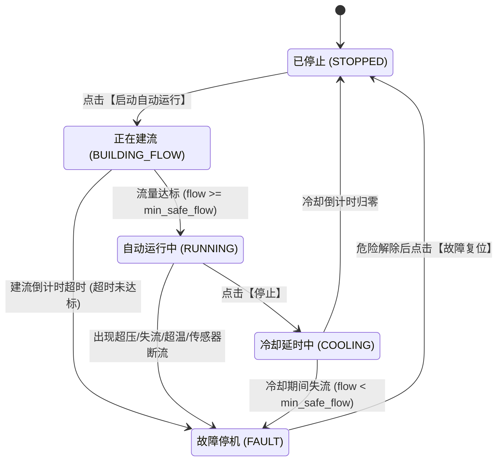

# 水循环系统控制指令、故障类型与状态机技术手册

本文档针对水循环系统界面中的**控制指令参数**、**故障类型与报警现象**、**状态机状态类型**提供精准的技术定义与行为规范。

---

## 一、指令参数详解

下表对应界面上【全局指令】与【设备指令】树中的每一个配置项，详细列出其参数标识、控件类型、单位、默认值及底层控制逻辑。

| 参数名称 | 数据库/代码字段 (`topic`) | 控件类型 | 推荐默认值 | 作用与底层判定逻辑 |
| :--- | :--- | :---: | :---: | :--- |
| **控制模式** | `master` | Switch 开关 | `on` (开) | **系统的总控制模式**。 • `on`（开启）：**自动模式**。展开并启用 10+ 项自动安全控温参数，支持点击【启动自动运行】进入状态机自动闭环循环。 • `off`（关闭）：**手动模式**。收起参数，展开水泵与加热的手动开关，由人工直接点动下发控制。 |
| **目标温度** | `target_temperature` | Input 输入框 | `30.0` ℃ | **自动控温的目标上限值**。 • 当出口水温 $T_{out} \ge target\_temperature$ 时，系统自动下发指令关闭加热（`heater -> off`）。 |
| **温度回差** | `temperature_hysteresis` | Input 输入框 | `0.5` ℃ | **防止继电器频繁跳动的控温死区缓冲区间**。 • **加热开启阈值** = $target\_temperature - temperature\_hysteresis$（例如 $30.0 - 0.5 = 29.5℃$）。 • 当出口水温 $T_{out} \le 29.5℃$ 时，系统自动下发开启加热（`heater -> on`）；在 29.5℃ 至 30.0℃ 之间保持现状不动作。 |
| **允许加热的最低流量** | `min_safe_flow` | Input 输入框 | `0.5` L/min | **防止加热棒干烧的流量安全底线**。 • 只有实时流量 $flow\_rate \ge min\_safe\_flow$ 时，才允许开启加热。 • 无论在自动还是手动模式下，若流量低于该值，禁止开启加热；运行中若低于该值则触发防干烧保护。 |
| **最大安全压力** | `max_safe_pressure` | Input 输入框 | `100.0` 或 `150.0` kPa | **防止管路破裂的压力上限**。 • 当管路实时压力 $pressure \ge max\_safe\_pressure$ 时，判定管路堵塞或憋压，系统立即强制停泵并关加热。 |
| **最高安全温度** | `max_safe_temperature` | Input 输入框 | `45.0` ℃ | **系统绝对超温硬保护红线**。 • 无论是入口温度 $T_{in}$ 还是出口温度 $T_{out}$，只要 $\max(T_{in}, T_{out}) \ge max\_safe\_temperature$，系统立即判定超温故障，强制切断加热。 |
| **水泵启动后等待建立流量的最长时间** | `build_flow_timeout` | Input 输入框 | `5` 秒 | **建流阶段倒计时**。 • 点击【启动自动运行】后，水泵开启抽水，系统开始倒计时。 • 若在设定时间内流量未达到 `min_safe_flow`，判定为水源不足或抽水失败，触发建流超时故障。 |
| **水泵运行中低流量故障确认时间** | `low_flow_confirm_time` | Input 输入框 | `2` 秒 | **低流量防误报滤波时间**。 • 在运行中若流量跌破 `min_safe_flow`，系统不立即跳闸，而是启动计时。 • 只有当低流量状态持续满设定秒数后，才正式判定为失流故障并停机，避免因气泡波动导致误停机。 |
| **关闭加热后水泵继续循环的时间** | `cooling_delay` | Input 输入框 | `5` 或 `10` 秒 | **停机后的余热排出时间**。 • 点击【停止】或系统进入停机流程时，加热器立即关闭，但水泵继续运转该设定时间，将发热管表面残余高温带走，倒计时归零后水泵才真正关闭。 |
| **数据更新超时时间** | `data_timeout` | Input 输入框 | `3` 秒 | **传感器离线/失联判定周期**。 • 系统维护每个传感器的最后更新时间戳。若当前时间与上次接收时间差超过此秒数，或值为 `null`，标记该传感器异常。 • 若系统处于运行状态，检测到关键传感器超时将立即停机。 |
| **MQTT发布超时时间** | `command_timeout` | Input 输入框 | `2` 秒 | **指令下发最大等待时间**。 • 应用层通过 MQTT 客户端发布控制指令时等待 Broker 响应的超时阈值。超时未发出则判定为指令发布失败并记录错误历史。 |
| **温度PID最小开启时间** | `pid_min_on_time` | Input 输入框 | `3` 秒 | **继电器物理保护参数**。 • 加热器每次被开启后，至少保持开启该时间，防止控制算法在极短时间内频繁启闭损坏触点。 |
| **温度PID最小关闭时间** | `pid_min_off_time` | Input 输入框 | `3` 秒 | **继电器物理保护参数**。 • 加热器每次被关闭后，至少保持关闭该时间，防止高频通断引起电弧或电网冲击。 |
| **水泵手动开关** | `pump` | Switch 开关 | `off` | **手动模式下的水泵控制**（仅在 `master=off` 时可见）。下发 `on` 开启水泵，下发 `off` 关闭水泵。 |
| **加热手动开关** | `heater` | Switch 开关 | `off` | **手动模式下的加热控制**（仅在 `master=off` 时可见）。下发前系统会自动前置安全审查，若不满足安全条件会被强制拦截回滚。 |

---

## 二、故障类型、触发条件与界面现象详解

系统内部使用结构化故障码（`faultCode`）进行故障判定，故障触发时会写入数据库 `t_error_msg`，并通过 WebSocket 实时推送到前端触发声光报警。

### 1. 故障类型全览表

| 故障类型代码 (`faultCode`) | 故障中文名称 | 触发判定条件 | 执行器保护动作 | 界面显示现象 |
| :--- | :--- | :--- | :--- | :--- |
| `BUILD_FLOW_TIMEOUT` | **启动建流超时** | 水泵启动进入建流状态后，在 `build_flow_timeout`（如 5s）倒计时归零前，实时流量依然 $< min\_safe\_flow$（0.5 L/min）。 | • 强制关闭水泵 • 保持关闭加热 | • 状态标签变为红色 `故障停机` • 状态栏红字显示：`故障：启动未建流(超过5s未达到最低流量)` • 触发声音告警 |
| `LOW_FLOW` | **运行中低流量（失流）** | 在自动运行（`RUNNING`）、加热器开启、或冷却状态下，实时流量 $< min\_safe\_flow$，且持续时间 $\ge low\_flow\_confirm_time$（如 2s）。 | • 立即强制关闭加热 • 立即强制关闭水泵 | • 状态标签变为红色 `故障停机` • 状态栏红字显示：`故障：运行中流量过低(X.XX L/min < 0.5 L/min)` • 触发声音告警 |
| `OVER_PRESSURE` | **管路超压故障** | 水泵处于运转状态时，管路压力传感器数值 $pressure \ge max\_safe\_pressure$（如 100 或 150 kPa）。 | • 立即强制关闭加热 • 立即强制关闭水泵 | • 状态标签变为红色 `故障停机` • 状态栏红字显示：`故障：管路超压(XX kPa >= XX kPa)` • 触发声音告警 |
| `OVER_TEMPERATURE` | **水温超限故障** | 进水温度 $T_{in}$ 或出水温度 $T_{out}$ 达到 $\ge max\_safe\_temperature$（如 45 ℃）。 | • **立即切断加热** • **水泵视工况处理**：若水流与压力正常，水泵保持开启协助循环散热；若管路有堵塞则停泵。 | • 状态标签变为红色 `故障停机` • 状态栏红字显示：`故障：水温超限(XX.X ℃ >= 45.0 ℃)` • 触发声音告警 |
| `SENSOR_FLOW_TIMEOUT` | **流量传感器数据超时/异常** | 距离上次收到合法 `flow_rate` 报文已超过 `data_timeout`（如 3s），或数值为非数字。且当前处于非停止状态。 | • 立即关闭加热 • 立即关闭水泵 | • 状态栏红字显示：`数据异常：流量` • 若在运行中则跳入 `故障停机`，红字显示：`故障：流量传感器数据超时或无效` |
| `SENSOR_PRESSURE_TIMEOUT` | **压力传感器数据超时/异常** | 距离上次收到合法 `pressure` 报文已超过 `data_timeout`（如 3s）。且当前处于非停止状态。 | • 立即关闭加热 • 立即关闭水泵 | • 状态栏红字显示：`数据异常：压力` • 若在运行中则跳入 `故障停机`，红字显示：`故障：压力传感器数据超时或无效` |
| `SENSOR_TEMPERATURE_TIMEOUT` | **温度传感器数据超时/异常** | 距离上次收到合法 `temp_in` 或 `temp_out` 报文已超过 `data_timeout`（如 3s）。且当前处于非停止状态。 | • 立即切断加热 • 若流量正常，进入冷却散热流程后停机；若失流则立即停泵。 | • 状态栏红字显示：`数据异常：入口温度、出口温度` • 状态栏红字显示：`故障：温度传感器数据超时或无效` |
| `COMMAND_PUBLISH_FAILED` | **指令发布失败** | 下发 MQTT 控制指令时，客户端连接断开或在 `command_timeout` 内未发布成功。 | • 回滚期望状态记录 | • 状态栏红字显示：`最后指令失败：XXXX` • 弹出 Element Plus 错误提示消息 |

### 2. 特殊安全拦截现象：手动模式安全前置审查
在手动模式下（`master = off`），用户手动点击开启【加热开关】时，系统会在下发前自动校验现场数据。如果不满足下列任一条件，**指令将被直接拦截，并在界面弹出警告弹窗，开关自动弹回关闭**：
1. **传感器数据超时**：弹窗提示 `数据超时或无效，禁止加热`；
2. **系统处于故障态**：弹窗提示 `设备仍处于故障状态: 请先复位`；
3. **水泵未开启**：弹窗提示 `水泵未开启，禁止加热`；
4. **流量不足**：弹窗提示 `当前流量不足(X.XX < 0.5 L/min)，严禁打开加热防止干烧`；
5. **压力过高**：弹窗提示 `当前管路压力过高(XX >= 150 kPa)`；
6. **水温过高**：弹窗提示 `当前水温过高(XX >= 45 ℃)`。

---

## 三、状态机状态类型详解

水循环控制引擎（`waterControlEngine.js`）维护了一个完整的有限状态机（FSM）。系统在任何时刻必处于以下 **5 种状态** 之一：

### 1. 已停止（`STOPPED`）
- **状态文本**：`已停止`（灰绿色标签）
- **执行器状态**：水泵期望 `off`（实际 `off`），加热期望 `off`（实际 `off`）。
- **状态说明**：系统的安全初始待命状态。所有驱动输出均处于断开状态。
- **离开该状态的条件**：
  - 点击【启动自动运行】按钮：校验启动条件（无故障、数据不超时、未超温超压），通过后开启水泵，转移至 `BUILDING_FLOW`。

### 2. 正在建流（`BUILDING_FLOW`）
- **状态文本**：`正在建流`（信息标签，界面显示建流倒计时秒数）
- **执行器状态**：水泵期望 `on`，**加热期望强制为 `off`**。
- **状态说明**：水泵刚启动的冲水阶段。此时管内尚未形成稳定流动，必须绝对禁止加热以防瞬间干烧。
- **流转条件**：
  - **成功转移至 `RUNNING`**：同时满足 `水泵实际已开(water_Y2=1)` 且 `实时流量 >= min_safe_flow` 且 `压力 < max_safe_pressure`。
  - **失败转移至 `FAULT`**：倒计时递减到 0 秒仍未满足上述流量条件，触发 `BUILD_FLOW_TIMEOUT` 故障，停泵停机。

### 3. 自动运行中（`RUNNING`）
- **状态文本**：`自动运行中`（绿色标签）
- **执行器状态**：水泵期望 `on`；加热期望根据水温在 `on` 与 `off` 之间自动切换。
- **状态说明**：系统正常巡航状态，自动执行闭环控温逻辑：
  - 当 $T_{out} \le target\_temperature - temperature\_hysteresis$ 时 $\rightarrow$ 下发开启加热；
  - 当 $T_{out} \ge target\_temperature$ 时 $\rightarrow$ 下发关闭加热。
- **流转条件**：
  - **正常停止转移至 `COOLING`**：用户在界面点击【停止】按钮，系统立即下发关闭加热，进入冷却延时；
  - **异常转移至 `FAULT`**：检测到管路超压、流量跌破安全阈值超过确认时间、水温超过最高安全温度、或传感器数据超时。

### 4. 冷却延时中（`COOLING`）
- **状态文本**：`冷却延时中`（黄色/信息标签，界面显示冷却倒计时秒数）
- **执行器状态**：**加热期望强制为 `off`**，水泵期望保持 `on`。
- **状态说明**：停机缓冲阶段。虽然加热棒已断电，但金属表面具有极高热惯性，水泵保持运转强行带走余热，防止管内死水被余热沸腾汽化损坏管路。
- **流转条件**：
  - **正常结束转移至 `STOPPED`**：冷却倒计时递减至 0 秒，系统自动下发关闭水泵（`pump -> off`），回到停止状态；
  - **异常转移至 `FAULT`**：冷却过程中若水泵无流量（$flow\_rate \le 0$），散热条件失效，立即停泵转移至故障状态。

### 5. 故障停机（`FAULT`）
- **状态文本**：`故障停机`（红色高亮标签）
- **执行器状态**：加热期望强制 `off`；水泵期望通常强制 `off`（若因水温超限且水流正常，水泵短时保持循环散热）。
- **状态说明**：系统安全锁定保护状态。此时禁止点击【启动自动运行】，手动控制开关同样处于锁定拦截状态。
- **解除故障的唯一途径**：
  - 必须在现场确认并消除安全隐患（恢复供水、疏通管路、水温降至安全范围、传感器恢复上报）；
  - 点击界面顶部的橙黄色**【故障复位】**按钮；
  - 后端校验安全条件（无超温、无超压、数据有效），确认通过后将执行器双关，系统重置回到 `STOPPED`（已停止）状态。
